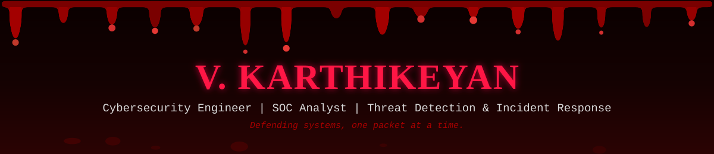

<div align="center">




<br/>


</div>

<br/>

## 🦇 About Me

```yaml
name: V. Karthikeyan
role: Cybersecurity Engineering Student (CGPA 8.89/10)
focus: SOC Operations - SIEM (Splunk) - Threat Detection - Incident Response - Vulnerability Assessment
currently_working_on: VulnScan & CipherVault Elite
learning: Advanced threat hunting, detection engineering, malware analysis
collaborate_on: Defensive security tools, SIEM detection rules, CTF challenges
ask_me_about: Splunk, Nmap, MITRE ATT&CK, CVSS, CTFs, cryptography
contact: LinkedIn - Email
```

<br/>


## 🛡️ Arsenal

**Security Operations**


**Vulnerability Assessment**


**Networking & Controls**


**Programming & Automation**


**Frameworks & Standards**


**Infrastructure & Tools**


<br/>


## 📊 GitHub Stats

<div align="center">


<br/><br/>


</div>

<br/>


## 🚀 Featured Projects

<table>
<tr>
<td width="50%" valign="top">

<h3 align="center">🔍 VulnScan</h3>
<p align="center">Automated Vulnerability Scanner</p>

Multi-stage reconnaissance (Quick / Standard / Deep), CVE/NVD mapping, CVSS scoring, PDF reporting.

<p align="center">


</p>
<p align="center"></p>

</td>
<td width="50%" valign="top">

<h3 align="center">🔐 CipherVault Elite</h3>
<p align="center">Cryptographic Security Analysis</p>

AES-256-GCM + RSA-4096, PBKDF2, attack resistance testing (bit-flipping, padding oracle, timing).

<p align="center">


</p>
<p align="center"></p>

</td>
</tr>
</table>

<br/>


## 🏆 Certifications & Achievements


<br/>


## 📡 Connect

<div align="center">

[](https://linkedin.com/in/v-karthi-keyan)
[](https://github.com/Karthiii06)
[](mailto:v.karthikeyan.root@gmail.com)

</div>

<br/>


</div>
